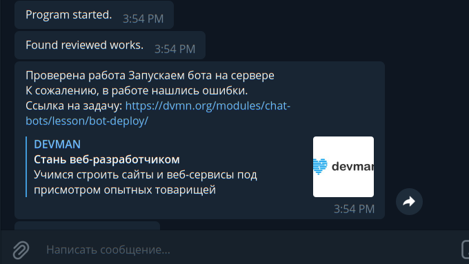

# Telegram бот-информатор для курсов dvmn.org

Информирует о том, что задание на курсах Девмана прошло проверку, а также сообщает результат проверки.

Для работы кода у тебя должен быть пользовательский ключ сайта dvmn.org (DVMN_TOKEN).
Если у тебя такого ключа нет, ты можешь просмотреть код бота.



### Как установить

Код является свободным, ты можешь установить его и пользоваться. Для этого тебе понадобится:

1. Установить Python 3.10+. [см. как установить (англ.)](https://realpython.com/installing-python/), а [здесь для Debian-based (рус.)](http://userone.ru/?q=node/41).

2. Получить API ключ для твоего бота. Для этого напиши [Отцу ботов](https://telegram.me/BotFather) и ответь на его вопросы.

3. Получить ID своего аккаунта в Telegram. Для этого напиши специальному боту @userinfobot. 

4. Получить пользовательский ключ сайта dvmn.org.

5. Установить ключи в переменных окружения (см. ниже).

Далее, скачай репозиторий к себе, установи и активируй виртуальное окружение:
```
    python3 -m venv env
    source env/bin/activate
```
установи необходимые библиотеки, указанные в файле requirements.txt:
```
    pip install -r requirements.txt
```
перейди в папку проекта и создай там папку для логов
```
    mkdir logs
```
потом запусти скрипт:
```
    python3 bot.py
```
Если у тебя возникает ошибка *chat not found* — напиши своему боту в Telegram. Пока ты не напишешь ему, у него нет чата с тобой. Это защита от рекламных рассылок, поэтому боты не могут написать пользователям первыми.


## Переменные окружения

Для улучшения уровня безопасности все ключи размещай в переменных окружения, в файле *.env* в папке проекта.
Также в переменных окружения укажи, какие каналы вывода логов задействовать:

```
DVMN_TOKEN=<token>
TG_TOKEN=<token>
TG_CHAT_ID=<id>
SAVE_LOGS_TO_FILE=False
SEND_LOGS_TO_STREAM=False
SEND_LOGS_TO_BOT=True
```

## Деплой

## Скрипт

Разместить скрипт можно на [Heroku](https://devcenter.heroku.com/articles/getting-started-with-python) (не рекомендую, но если захочешь - используй Procfile из репозитория) или на сервере, см. например, [инструкцию для Django](https://habr.com/ru/post/501414/), из которой достаточно взять только часть для установки скрипта, опустив установку базы данных и т.п.

## Docker

Для запуска бота с помощью Docker в папке проекта запусти создание образа:
```sh
docker build . -t dvmnchecker
```
Вместо *dvmnchecker* можешь выбрать любое имя.

Запусти работу контейнера
```sh
docker run --env-file ./.env --volume ${HOME}/logs:/logs dvmnchecker
```

### Цель проекта

Код написан в образовательных целях на онлайн-курсе для веб-разработчиков [dvmn.org](https://dvmn.org/).
